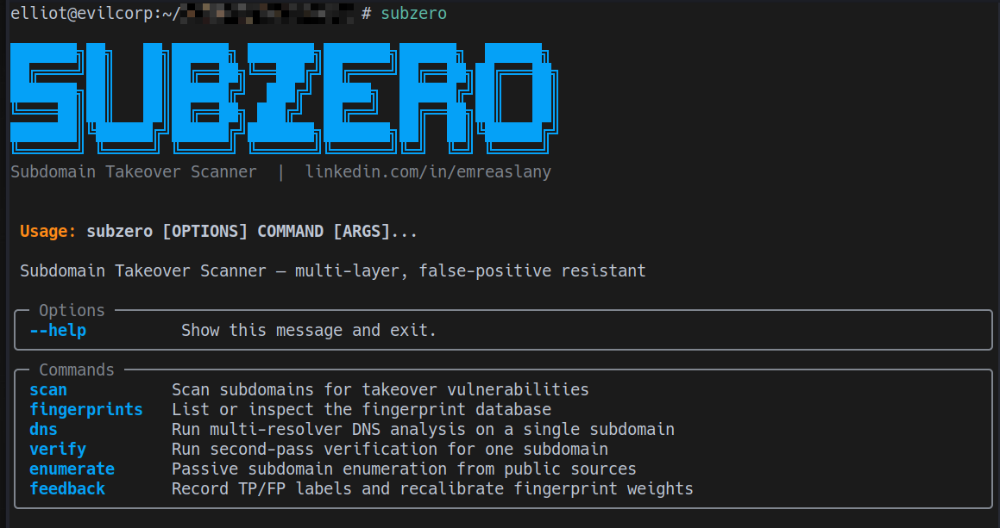
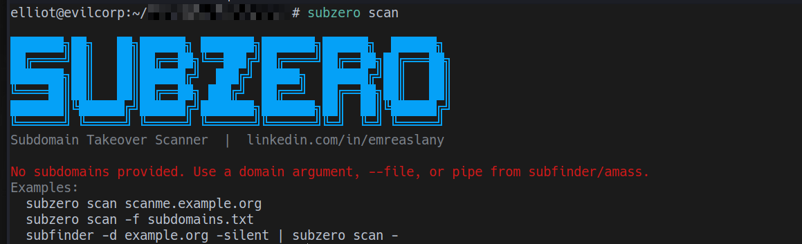
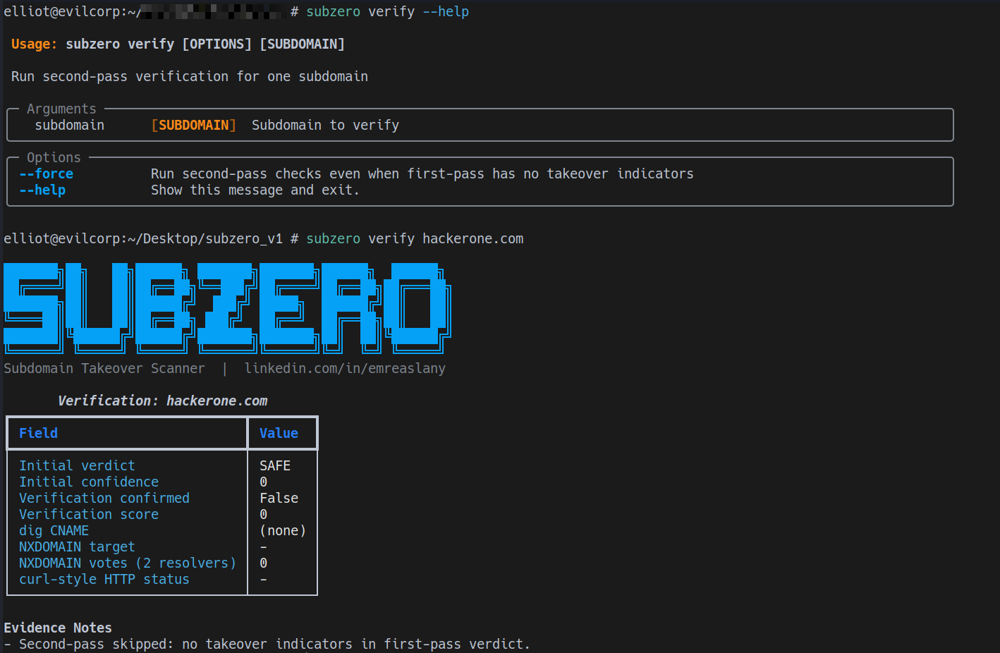
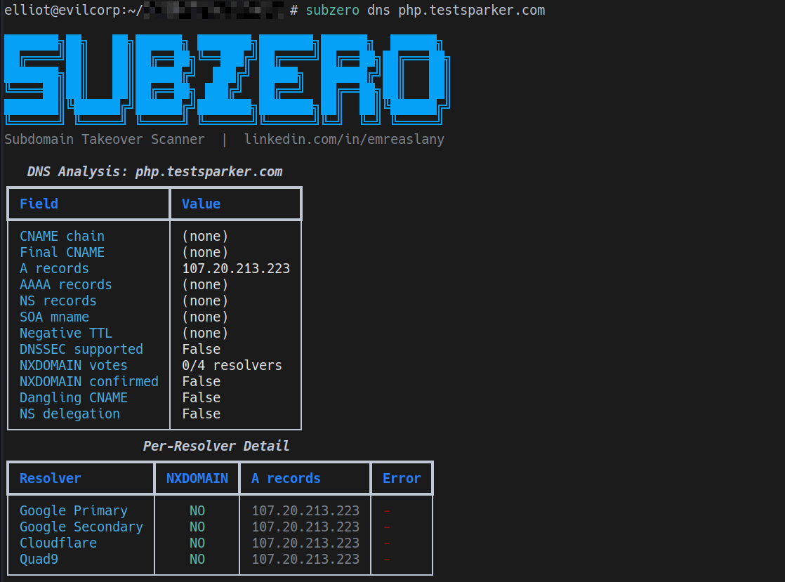
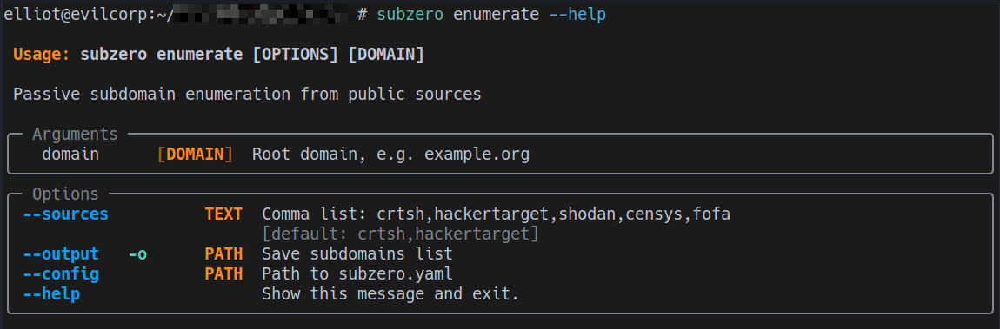
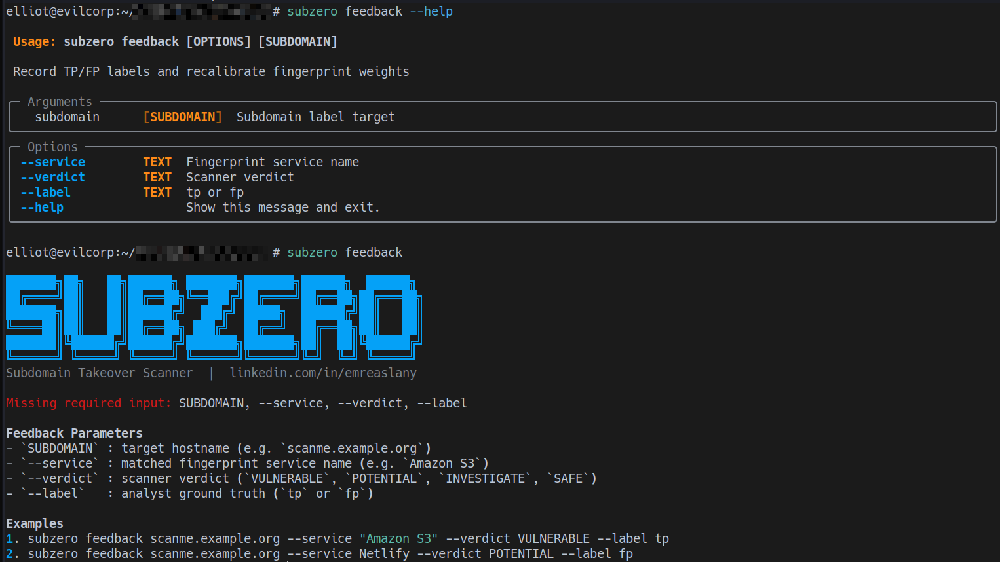

# Subzero

Subzero is an async subdomain takeover scanner with layered validation, evidence-first output, and configurable workflows.

This version adds:

- Larger regression fixture suite
- `subzero.yaml` configuration support
- `--explain` mode for human-readable verdict reasoning

## Installation

Requirements:

- Python 3.10+
- pip

Install:

```bash
pip install -e .
```

Dev install:

```bash
pip install -e .[dev]
```

## Quick Start

```bash
subzero
subzero scan scanme.example.org --profile strict --explain
subzero verify scanme.example.org
subzero enumerate example.org -o passive.txt
subzero scan -f passive.txt -o report.json
```



## Commands

## `scan`

```bash
subzero scan [TARGET] [OPTIONS]
```

Important options:

- `-f, --file`: input file (or `-` for stdin)
- `-c, --concurrency`: worker count
- `--profile`: `strict | balanced | fast`
- `--min-verdict`: `VULNERABLE | POTENTIAL | INVESTIGATE`
- `--evidence`: `min | full`
- `--explain`: add plain-language finding explanations
- `--config`: load config file (default `./subzero.yaml` if present)

Examples:

```bash
subzero scan scanme.example.org --profile strict --explain
subzero scan -f subdomains.txt --profile balanced --evidence full -o report.md
subfinder -d example.org -silent | subzero scan - --profile fast --min-verdict POTENTIAL
```



## `verify`

```bash
subzero verify scanme.example.org
```

Performs second-pass checks:

- dig-style CNAME re-check
- two-resolver NXDOMAIN re-check
- curl-style HTTP status/body re-check



## `dns`

```bash
subzero dns scanme.example.org
```

Shows:

- CNAME chain
- A/AAAA
- NS
- NXDOMAIN votes
- SOA mname / negative TTL
- DNSSEC support signal



## `enumerate`

```bash
subzero enumerate example.org --sources crtsh,hackertarget,shodan,censys,fofa -o passive.txt
```

Supported sources:

- `crtsh`
- `hackertarget`
- `shodan` (requires `SHODAN_API_KEY`)
- `censys` (requires `CENSYS_API_ID`, `CENSYS_API_SECRET`)
- `fofa` (requires `FOFA_EMAIL`, `FOFA_KEY`)

Duplicate handling:

- Subzero merges all source results into a unique set.
- Duplicate subdomains across sources are automatically removed.



## `feedback`

```bash
subzero feedback scanme.example.org --service "Amazon S3" --verdict VULNERABLE --label tp
subzero feedback scanme.example.org --service "Netlify" --verdict POTENTIAL --label fp
```



## Explain Mode

`--explain` adds operator-readable rationale for non-safe findings.

Explanation includes:

- final verdict and confidence
- top positive signals
- penalty signals (counter-evidence)
- second-pass verification status
- provider ownership check summary

Use it for faster triage and report writing.

## Configuration (`subzero.yaml`)

Subzero can load defaults from a config file.

Create `subzero.yaml` (or pass `--config <path>`):

```yaml
scan:
  profile: strict
  concurrency: 40
  min_verdict: INVESTIGATE
  evidence: full
  explain: true

enumerate:
  sources:
    - crtsh
    - hackertarget
    - shodan
    - censys
    - fofa
```

Example file is included: `subzero.yaml.example`.

## Detection Pipeline

1. Resolve DNS and CNAME chain.
2. Probe HTTP/HTTPS responses.
3. Match fingerprints and compute confidence.
4. Apply contradiction penalties (e.g. healthy HTTP/A/AAAA evidence).
5. If `VULNERABLE`, run second-pass verification.
6. Run provider ownership checks.
7. Recompute final verdict from final confidence.
8. Compute risk score v2 and attach evidence bundle.

## Output

## JSON / Markdown

```bash
subzero scan -f subdomains.txt -o report.json
subzero scan -f subdomains.txt -o report.md
```

Both include confidence and evidence bundle; JSON is machine-friendly, Markdown is triage-friendly.

## Key Files

- `subzero/cli.py`
- `subzero/scanner.py`
- `subzero/validator.py`
- `subzero/config.py`
- `tests/fixtures/cases.json`
- `subzero.yaml.example`

## Limitations

- Provider checks are currently best-effort unless you extend with authenticated provider APIs.
- Fingerprint maintenance is ongoing work; vendor error pages can drift.
- Manual validation remains recommended before exploitation/report submission.

## Legal

Use only on authorized assets.
